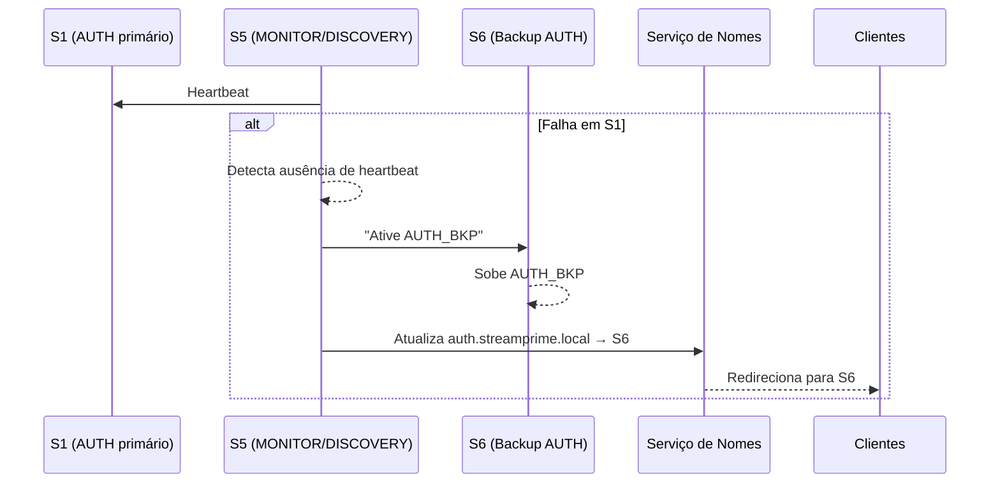
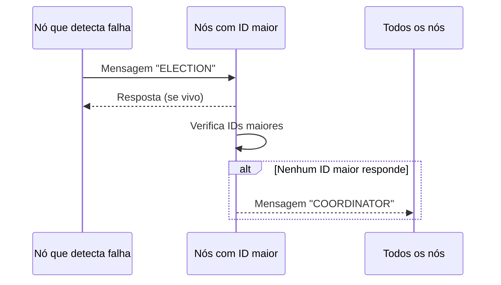

# Noctarflix – Distributed System Blueprint

## 1. Visão Geral
Noctarflix é um aplicativo de streaming distribuído (apps web e mobile) para filmes e séries. O sistema é organizado em seis processos independentes para favorecer escalabilidade, segurança e deploys isolados.

### Processos Principais
| Processo | Nome | Responsabilidade | Motivo de separação |
| --- | --- | --- | --- |
| P1 | AUTH | Cadastro, login, tokens, recuperação de senha, perfis | Segurança e políticas próprias; escala independente |
| P2 | CATALOG | Catálogo de títulos, busca, recomendações personalizadas | Alto volume de leitura; recomendações e indexação |
| P3 | STREAMING | Sessões de reprodução, URLs de mídia, qualidade adaptativa, integração com CDN | Altíssimo consumo de banda; escala dedicada |
| P4 | BILLING | Planos, cobranças, faturas, status de assinatura | Compliance e integrações com gateways de pagamento |
| P5 | MONITOR/DISCOVERY | Métricas, health-check, serviço de nomes, failover | Base de observabilidade e alta disponibilidade |
| P6 | NOTIFY | E-mails, push, alertas de conteúdo e pagamento | Workloads assíncronos e tolerantes a falhas |

## 2. Frontend – Tela Principal (1920x1080)
Representação em wireframe para a tela inicial (tema escuro, gradiente):

```mermaid
graph LR
  A[Header: Logo "StreamPrime" à esquerda] --- B[Botões: "Entrar" (AUTH), "Assinar agora" (BILLING) à direita]
  A === C[Hero Banner: Destaque do filme/série]
  C --> D[Botão principal: "Assistir agora" → STREAMING]
  C --> E[Botão secundário: "Ver detalhes"]
  F[Carrossel: Recomendados para você]:::carousel
  G[Carrossel: Em alta]:::carousel
  H[Carrossel: Continuar assistindo]:::carousel
  I[Rodapé: Suporte · Termos · Idiomas]
  C --- F
  F --- G
  G --- H
  H --- I

  classDef carousel fill:#1f1f1f,stroke:#444,stroke-width:1px,color:#fff;
```

* Fundo: gradiente preto/cinza.
* Banner: retângulo horizontal grande, centralizado.
* Capas: quadrados/retângulos menores nos carrosséis.
* Ligações frontend → serviços: "Entrar" → AUTH, "Assinar agora" → BILLING, "Assistir agora" → STREAMING, listas e recomendações → CATALOG.

## 3. Servidores, Redundância e Failover
### 3.1 Mapeamento de servidores
| Servidor | Processo principal | Backup passivo de |
| --- | --- | --- |
| S1 | AUTH | CATALOG |
| S2 | CATALOG | STREAMING |
| S3 | STREAMING | BILLING |
| S4 | BILLING | MONITOR/DISCOVERY |
| S5 | MONITOR/DISCOVERY | NOTIFY |
| S6 | NOTIFY | AUTH |

### 3.2 Fluxo de failover (exemplo AUTH)


Failback: quando S1 retorna, ele se registra no monitor, S5 agenda failback, finaliza sessões no AUTH_BKP, sincroniza estado e restaura auth.streamprime.local → S1.

## 4. Rede Lógica
```mermaid
graph TD
  subgraph Clientes
    TV[Smart TV]
    SP[Smartphone]
    WEB[Navegador]
  end

  subgraph Core
    GW[API Gateway / Load Balancer]
    S1[AUTH]
    S2[CATALOG]
    S3[STREAMING]
    S4[BILLING]
    S5[MONITOR/DISCOVERY]
    S6[NOTIFY]
    DB[(DB Cluster: DB1/DB2/DB3)]
    CDN[(CDN/Storage de Vídeo)]
  end

  TV -->|HTTP/HTTPS| GW
  SP -->|HTTP/HTTPS| GW
  WEB -->|HTTP/HTTPS| GW

  GW -->|gRPC (verde)| S1
  GW -->|gRPC| S2
  GW -->|gRPC| S3
  GW -->|gRPC| S4
  GW -->|gRPC| S6

  S1 ---|lógica de backup (vermelho tracejado)| S2
  S2 ---|lógica de backup| S3
  S3 ---|lógica de backup| S4
  S4 ---|lógica de backup| S5
  S5 ---|lógica de backup| S6
  S6 ---|lógica de backup| S1

  S1 -->|DB| DB
  S2 -->|DB| DB
  S3 -->|DB| DB
  S4 -->|DB| DB
  S5 -->|DB| DB
  S6 -->|DB| DB

  S3 -->|Vídeo| CDN

  S5 <--> |Heartbeats (laranja)| S1
  S5 <--> |Heartbeats| S2
  S5 <--> |Heartbeats| S3
  S5 <--> |Heartbeats| S4
  S5 <--> |Heartbeats| S6
```

## 5. Comunicação entre Processos
### 5.1 Tecnologia
* Gateway / Clientes → Serviços: HTTP/HTTPS (REST).
* Serviços internos: gRPC (HTTP/2 + Protobuf). Permite streaming, menor overhead e schemas estáveis.

### 5.2 Tabela de chamadas
| Quem chama | Quem é chamado | Ação | Tecnologia | Tipo |
| --- | --- | --- | --- | --- |
| Gateway/App | AUTH | Login | gRPC | Síncrono |
| Gateway/App | CATALOG | Buscar catálogo / recomendações | gRPC | Síncrono |
| Gateway/App | STREAMING | Iniciar sessão e obter URL | gRPC | Síncrono |
| AUTH | BILLING | Criar assinante | gRPC | Assíncrono (fire-and-forget) |
| BILLING | NOTIFY | Avisos de pagamento | gRPC | Assíncrono |
| STREAMING | MONITOR/DISCOVERY | Métricas de uso | gRPC | Assíncrono |
| Todos | MONITOR/DISCOVERY | Heartbeat/registro | gRPC | Síncrono |

### 5.3 Fluxo: Play de um vídeo
1. App → Gateway: `POST /play?videoId=123`.
2. Gateway → AUTH: valida token (gRPC síncrono).
3. Gateway → BILLING: verifica assinatura ativa (gRPC síncrono).
4. Gateway → STREAMING: cria sessão e obtém URL/CDN (gRPC síncrono).
5. Gateway responde ao app com a URL.
6. Paralelos assíncronos: STREAMING → MONITOR (métricas); BILLING → CATALOG (evento de conteúdo assistido para recomendação).

## 6. Sincronização (Relógios de Lamport)
* Cada servidor mantém um contador lógico `L`.
* Antes de evento interno: `L = L + 1`.
* Ao enviar mensagem: inclui `L`.
* Ao receber timestamp `T`: `L = max(L_local, T) + 1`.

Exemplo de evento fora de ordem (login antes do pagamento chegar):
* BILLING (S4) processa pagamento `L=5` e envia mensagem a AUTH com `T=5`.
* AUTH está em `L=10`, processa login (`L=11`).
* Mensagem de BILLING chega com `T=5`; AUTH calcula `L = max(11,5)+1 = 12`, mantendo a ordenação lógica e garantindo consistência de acesso.

## 7. Coordenação e Eleição de Líder (Bully)
* IDs: S1=1, S2=2, S3=3, S4=4, S5=5, S6=6. Líder inicial: S6.
* Falha do líder S6: S4 inicia eleição → S5 responde → S5 tenta S6 (sem resposta) → S5 se declara líder e broadcast "COORDINATOR".
* Falha posterior de S5: S3 inicia eleição → S4 responde (maior ID vivo) → S4 tenta S5/S6 (sem resposta) → S4 se torna líder.
* Responsabilidades do líder: coordenar failover e nomes, distribuição de configurações globais, janelas de manutenção.



## 8. Serviço de Nomes
* Implementado dentro do MONITOR/DISCOVERY (S5).
* Nomes lógicos e destinos primário/backup:

| Nome lógico | Função | Primário | Backup |
| --- | --- | --- | --- |
| auth.streamprime.local | AUTH | S1:5000 | S6:5000 |
| catalog.streamprime.local | CATALOG | S2:5001 | S1:5001 |
| streaming.streamprime.local | STREAMING | S3:5002 | S2:5002 |
| billing.streamprime.local | BILLING | S4:5003 | S3:5003 |
| monitor.streamprime.local | MONITOR/DISCOVERY | S5:5004 | S4:5004 |
| notify.streamprime.local | NOTIFY | S6:5005 | S5:5005 |

### Resolução
* Exemplo: AUTH consulta `catalog.streamprime.local` → serviço de nomes retorna IP/porta (p.ex. S2). Em falha, o líder atualiza a entrada para o backup (S1); o cliente continua usando o nome lógico sem mudanças.

## 9. Checklist de implementação
- [x] Processos distribuídos e justificativas.
- [x] Wireframe da tela inicial com vínculos aos serviços.
- [x] Mapa de servidores com backups e fluxo de failover.
- [x] Rede lógica com gateway, serviços, DB e CDN.
- [x] Tabela de comunicações gRPC/REST.
- [x] Fluxo de play com chamadas síncronas e assíncronas.
- [x] Estratégia de relógios lógicos de Lamport.
- [x] Eleição de líder (Bully) e responsabilidades.
- [x] Serviço de nomes com primário/backup.
